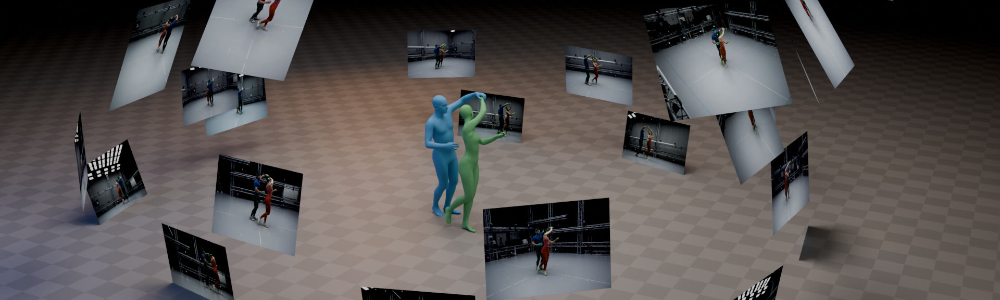

<div align="center">

# MAMMA: Markerless Accurate Multi-person Motion Acquisition

Hanz Cuevas Velasquez<sup>1\*</sup>, Anastasios Yiannakidis<sup>1\*</sup>, Soyong Shin<sup>2</sup>, Giorgio Becherini<sup>1</sup>, Markus Höschle<sup>1</sup>, Joachim Tesch<sup>1</sup>, Taylor Obersat<sup>1</sup>, Tsvetelina Alexiadis<sup>1</sup>, Eni Halilaj<sup>2</sup>, Michael J. Black<sup>1</sup>

<sup>1</sup>Max Planck Institute for Intelligent Systems, Tübingen &nbsp;&nbsp; <sup>2</sup>Carnegie Mellon University

<sup>\*</sup>Equal contribution



**[CVPR 2026 Oral]** | [Paper](https://openaccess.thecvf.com/content/CVPR2026/html/Velasquez_MAMMA_Markerless_Accurate_Multi-person_Motion_Acquisition_CVPR_2026_paper.html) | [arXiv](https://arxiv.org/abs/2506.13040) | [Project Page](https://mamma.is.tue.mpg.de/) | [Datasets](https://mamma.is.tue.mpg.de/download.php)

</div>

## News
- [2026-06] 🎉 MAMMA being presented at CVPR 2026
- [2026-06] Code released (inference + training)


---

## Install

```bash
git clone https://github.com/cuevhv/mamma.git
cd mamma
```

Full env + CUDA + weights setup: **[docs/INSTALL.md](docs/INSTALL.md)**.

```bash
micromamba activate mamma          # or: conda activate mamma
python -m inference doctor         # verify env vars + weight paths
```

The pipeline is zero-config when weights live under `data/`.

---

## Quick demo

Bundled 4-cam example, ~56 MB:

```bash
bash data/download_example.sh                                       # fetches videos to data/mamma_example/
```
```bash
python -m inference run \
  --cfg      configs/examples/presets/quick.yaml \
  --footage  data/mamma_example \
  --seq_name pushing_and_lifting_from_ground \
  --calib    configs/examples/calib/iphones_outdoors.yaml \
  --out-tag  demo -v
```

Outputs land under `output/ma_*/demo/mamma_example/…`.

**Prefer a browser UI?** Run `bash gui/scripts/dev.sh`, open <http://localhost:3000>, and click **Run demo**. It's the same pipeline but friendlier UX!

---

## Pipeline

`ma_cap → ma_masks → ma_2d → ma_3d → ma_vis`

| Step       | What it does                                 |
|------------|----------------------------------------------|
| `ma_cap`   | Loads multi-view capture |
| `ma_masks` | Per-person segmentation (SAM + YOLO)         |
| `ma_2d`    | 2D landmark detection (MammaNet)             |
| `ma_3d`    | Multi-view SMPL-X optimization               |
| `ma_vis`   | Per-camera overlays + interactive scene      |

Entry point: `python -m inference run` (source: [`inference/cli/run.py`](inference/cli/run.py)).

| Argument               | What it is                                                                                  |
|------------------------|---------------------------------------------------------------------------------------------|
| `--cfg` / `--preset`   | Pipeline-configuration YAML — declares which steps run and their hyperparameters. Capture-independent. ([what a preset is + how to modify one](docs/CONFIGS.md)) |
| `--footage`            | Dataset root containing sequence subdirs (use with `--seq_name` + `--calib`). ([layout reference](docs/YOUR-DATA.md#1-lay-out-your-footage)) |
| `--seq_name`           | One sequence subdirectory name under `--footage` to process (one run = one sequence).      |
| `--calib`              | Calibration file (`.yaml` / `.xcp` / OpenCV `.json`); applies to every sequence under `--footage`. ([format reference](docs/YOUR-DATA.md#2-author-the-calibration-file)) |
| `--capture`            | Advanced: capture JSON pointing at footage, calibration, sequences, and camera names — used to iterate over many sequences in one invocation. ([schema reference](docs/YOUR-DATA.md#3-mint-a-capture-descriptor)) |
| `--out-tag`            | Output sub-directory tag under `output/ma_*/<tag>/` (default: `local`).                     |
| `-v`                   | Verbose runner logs.                                                                        |

### Run the pipeline

Three things are needed:

1. A **calibration file** ([how to make one](docs/YOUR-DATA.md#2-author-the-calibration-file))
2. A **folder with your sequence** ([how to set it up](docs/YOUR-DATA.md#1-lay-out-your-footage))
3. A **preset** — use a shipped one: [`configs/examples/presets/quick.yaml`](configs/examples/presets/quick.yaml) (~5 min smoke) or [`configs/examples/presets/full.yaml`](configs/examples/presets/full.yaml) (full-frame). See [`docs/CONFIGS.md`](docs/CONFIGS.md) to modify or author your own.

Then:

```bash
python -m inference run \
  --cfg      <path/to/preset>.yaml \
  --footage  <path/to/footage> \
  --seq_name <seq_name> \
  --calib    <path/to/calib>.yaml \
  --out-tag  run01 -v
```

**Alternative — iterate over many sequences in one invocation.** A [capture JSON](docs/YOUR-DATA.md#3-mint-a-capture-descriptor) enumerates sequences, cameras, and the calibration in one file; the runner walks them automatically:

```bash
python -m inference run \
  --cfg     <path/to/preset>.yaml \
  --capture <path/to/capture>.json \
  --out-tag run01 -v
```

---

## GUI

Browser UI for submitting and inspecting runs. It uses the same `mamma` python env.

```bash
gui/scripts/dev.sh        # dev: Flask :8000 + Vite :3000 (auto-reload)
gui/scripts/prod.sh       # prod: single Flask process on :8000
```

Setup and deployment: [`gui/README.md`](gui/README.md).

---

## MAMMA datasets

The paper's released captures, evaluation data, and synthetic training data live on the MAMMA project page and require a free account.

1. Register at <https://mamma.is.tue.mpg.de/> and confirm your email.
2. Either use the GUI's *Pipeline assets* panel (sign in once, click to download), or run the per-dataset shell scripts under [`data/`](data/):

   ```bash
   bash data/download_mamma_dance.sh --bachata --meta --pred --videos_crf24
   ```

Five dataset families ship: **dance**, **multi-person**, **iPhone**, **eval**, and **synthetic**. Per-dataset sizes, video encodings, and the full script flag surface live in **[docs/DATASETS.md](docs/DATASETS.md)**.

> Just running on your own footage? You don't need any of this — see [Run the pipeline](#run-the-pipeline) above.

---

## Layout

```
.
├── inference/       runner, step builders, doctor CLI
├── capture/         ma_cap step
├── segmentation/    ma_masks step
├── landmarks/       ma_2d step
├── optimization/    ma_3d step
├── visualization/   ma_vis step
├── configs/         presets + capture manifests
├── data/            body models + weights + datasets (gitignored)
├── output/          run outputs (gitignored)
├── gui/             browser UI (Flask + React)
└── scripts/         smoke tests + utilities
```

---

## TODO

- [ ] Release the evaluation scripts (2D landmark + benchmark evaluation) and the processed evaluation datasets.

---

## Citation

```
@inproceedings{cuevas2026mamma,
  title     = {{MAMMA}: {Markerless Accurate Multi-person Motion Acquisition}},
  author    = {Cuevas Velasquez, Hanz and Yiannakidis, Anastasios and Shin, Soyong and Becherini, Giorgio and H{\"o}schle, Markus and Tesch, Joachim and Obersat, Taylor and Alexiadis, Tsvetelina and Halilaj, Eni and Black, Michael J.},
  booktitle = {Proceedings of the IEEE/CVF Conference on Computer Vision and Pattern Recognition (CVPR)},
  year      = {2026}
}
```

## Acknowledgments

MAMMA builds on a number of open-source models, datasets, and tools. We thank their authors for releasing their work openly.

- [**SAM 2**](https://github.com/facebookresearch/sam2) and [**SAM 3**](https://github.com/facebookresearch/sam3): Meta FAIR; segmentation backbones.
- [**YOLOv12**](https://github.com/ultralytics/ultralytics): Ultralytics; person detection.
- [**SMPL-X**](https://smpl-x.is.tue.mpg.de/): MPI-IS; expressive body model.
- [**ViTPose**](https://github.com/ViTAE-Transformer/ViTPose): pretrained human-pose backbone.
- [**HRNet**](https://github.com/HRNet): alternative pose-estimation backbone.
- [**CameraHMR**](https://camerahmr.is.tue.mpg.de/): MPI-IS; landmark architecture baseline.
- [**BEDLAM**](https://bedlam.is.tue.mpg.de/): MPI-IS; synthetic dataset of humans in motion.
- [**Rerun**](https://rerun.io): interactive 3D scene viewer.
- [**Detectron2**](https://github.com/facebookresearch/detectron2): Meta FAIR; vision research library.
- [**PyTorch Lightning**](https://github.com/Lightning-AI/pytorch-lightning), [**Hydra**](https://github.com/facebookresearch/hydra), and [**WebDataset**](https://github.com/webdataset/webdataset): training infrastructure.

## License

For non-commercial scientific research purposes [LICENSE](LICENSE).

## Contact

Questions, bug reports, or other inquiries: [mamma@tue.mpg.de](mailto:mamma@tue.mpg.de).
