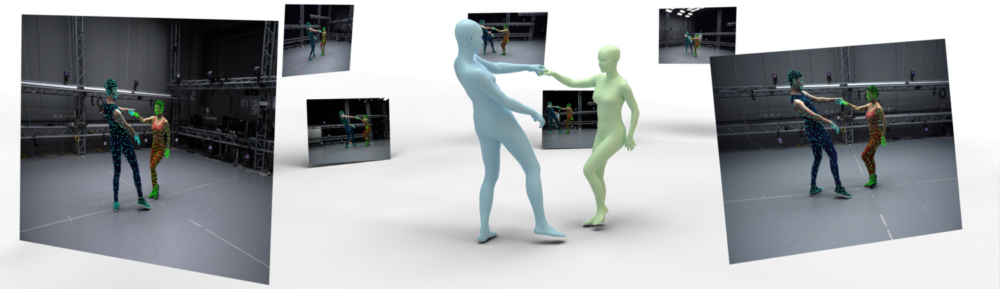

# MAMMA GUI

<p align="center">
  
</p>

A browser UI for running and monitoring the MAMMA multi-view body-fitting
pipeline **locally**, on a single machine. Pipeline execution is the same
`inference` runner the CLI uses (`python -m inference run …`); this
directory is just orchestration + UI + bookkeeping on top of it.

| | |
|---|---|
| **Backend** | Flask, serves a small JSON API and (in prod mode) the built React bundle. |
| **Frontend** | React 18 + TypeScript + Tailwind v4, bundled with Vite. |
| **Job submission** | Spawns `python -m runner_main` (a thin shim over `inference.runner.run_dag`) per task. |
| **DB** | SQLite, single file under `gui/var/` (gitignored). |
| **Pipeline engines** | `conda` (default), `apptainer`, or `docker` — picked per-step from the task file. |
| **Auth** | None — single-user local tool. Bound to `127.0.0.1` by default. |

## Install

Everything lives in a single `mamma` conda env maintained by the parent
repo. Flask, Flask-CORS, python-dotenv, pyyaml, waitress, and Node 20
are all pulled in by
`mamma_release/requirements/{mamma_conda.yaml,requirements.txt}` — no
separate "webtool" env. Follow the parent
[`INSTALL.md`](../docs/INSTALL.md) for the full pipeline install, then:

```bash
conda activate mamma
(cd gui/frontend && npm install)    # one-time
```

## Run

```bash
conda activate mamma
```

**Dev mode** — hot module replacement, two-port topology, Werkzeug
backend (debugger + auto-reloader on):

```bash
gui/scripts/dev.sh
```

- Flask on http://localhost:8000
- Vite on http://localhost:3000 (proxies `/api/*` to :8000)
- Open <http://localhost:3000>.

**Prod mode** — single port, single waitress worker, static React
bundle, no Vite, no debugger, multi-threaded:

```bash
gui/scripts/prod.sh                  # build once, then serve
gui/scripts/prod.sh --skip-build     # reuse gui/frontend/build/ if present
```

- Flask + bundle on http://localhost:8000
- Re-run with a fresh build whenever you change the frontend.

Both scripts share env defaults (`MAMMA_DATA_DIR=gui/var/`,
`MAMMA_INTERFACE_DIR=gui/var/interface/`,
`MAMMA_DEFAULT_TASK_JSON=configs/examples/quick_tasks/140725_Breakdance.yaml`) and seed
the preset picker from `configs/examples/` on first launch.

`Ctrl-C` cleanly stops the servers (and any child processes).

## UI tour

Five top-level tabs:

| Tab | Purpose |
|---|---|
| **Home** | Landing page — pipeline overview and shortcuts. |
| **Captures** | Manage `capture.json` files. Add from an images-root + calibration; edit fields inline; delete with a confirmation that warns when historical tasks reference the capture. |
| **Tasks** | Submit new pipeline runs and monitor live progress. The cross-capture **(task × sequence) matrix** is the main view, with status-pill, capture, and free-text filters and a "Latest run only" collapse. Click a cell → side panel with status, log/out/err viewers, **View task config**, **Browse outputs**, and **Stop** for running steps. |
| **Results** | Browse the filesystem outputs of past runs. Pick a capture → (task / sequence / process) tuple → walk the produced files. |
| **Database** | Reconcile the SQLite DB with what's on disk. Imports CLI-only runs (those started with `python -m inference run`) into the DB so they show up alongside GUI-submitted ones, and cleans up DB rows whose output dirs are gone. |

## Quickstart smoke

Goal: from a fresh checkout to
`ma_cap[140725_Breakdance_Improv_1_03684_03686_1]` flipping to
**Done** in the Tasks matrix, using the bundled Breakdance quick example.

### Prerequisites already done

- `mamma_release` cloned; you're inside it.
- `mamma` env installed with `conda env create -f requirements/mamma_conda.yaml`
  → `conda activate mamma` → `pip install -r requirements/requirements.txt` →
  the `--no-build-isolation` line from
  [`INSTALL.md`](../docs/INSTALL.md).
- `gui/frontend/` `npm install`-ed once.
- `python -m inference doctor` reports **PASS** (body models, weights,
  and the downsampled-verts pickle are in `data/`).

### Steps

```bash
conda activate mamma
gui/scripts/dev.sh
```

Open <http://localhost:3000>, then:

1. **Captures** tab → pick the bundled
   `140725_Breakdance` (visible under the **example** badge), or
   "Generate new" to add your own.
2. **Tasks** tab → "+ New task" →
   - **Preset:** `quick_tasks/140725_Breakdance` (seeded by `dev.sh`).
   - **Seq Names:** `140725_Breakdance_Improv_1_03684_03686_1`.
   - **Output dir:** leave blank → defaults to the parent's top-level
     `output/` directory (shared with CLI runs).
   - **Output ID:** anything unique.
3. Click **Start task**. The matrix flips each `(step, sequence)`
   cell `Waiting → Running → Done` in real time (polls every 2 s).
4. Click a cell for the side panel: log / out / err viewers,
   **View task config**, **Browse outputs**, **Stop**.

Final artifacts land in:

```
mamma_release/output/<step>/<output_id>/140725_Breakdance/140725_Breakdance_Improv_1_03684_03686_1/
```

Pipeline run identical to what the CLI would produce —
`python -m inference run --task configs/examples/quick_tasks/140725_Breakdance.yaml`.

## Adding & editing presets

Curated presets live in `$MAMMA_INTERFACE_DIR/samples/tasks/*.{json,yaml}`.
`dev.sh` and `prod.sh` seed this directory from the parent's
`configs/examples/` on first launch. Each preset can carry optional
`global.display_name` and `global.description` that the UI renders.

User-saved presets land in `$MAMMA_INTERFACE_DIR/samples/tasks/user/`
and appear in the same dropdown badged **User**. Curated presets are
read-only from the API.

## Verifying without the UI

The same task file the GUI submits is a regular `inference` task
file. If you suspect the webtool layer:

```bash
# Full DAG, headless
python -m inference run --task configs/examples/quick_tasks/140725_Breakdance.yaml --out-tag standalone -v

# Single step
python -m inference run-step --task configs/examples/quick_tasks/140725_Breakdance.yaml --step ma_2d -v

# Pre-flight env check
python -m inference doctor
```

If the CLI run succeeds and the GUI doesn't, the issue is in
`gui/backend/app.py` or `gui/backend/runner_main.py`, not in the
pipeline.

## Pipeline

Body branch only — the public release ships 5 steps:

```
ma_cap → ma_masks → ma_2d → ma_3d → ma_vis
```

Each step is built by `inference/steps/<step>.py` (in the parent repo).
Run order respects each step's `dependencies` list in the task file.
See [`docs/steps.md`](../docs/steps.md) for the full DAG + per-step
upstream repos.

### Task config schema

Task files are YAML or JSON. Canonical example:
[`configs/examples/quick_tasks/140725_Breakdance.yaml`](../configs/examples/quick_tasks/140725_Breakdance.yaml).
Schema reference: [`docs/CONFIGS.md`](../docs/CONFIGS.md).

Per-step engine selection (lifted from the GUI's UX into the
schema):

```yaml
ma_cap:
  engine: conda                       # "conda" (default) | "apptainer" | "docker"
  conda_env: mamma                    # default conda env if engine=conda
  docker_image: mamma/cap:latest      # only if engine=docker
  sif_path: /path/to/ma_cap.sif       # only if engine=apptainer
  ...
```

The same task file is consumed by `python -m inference run` and by
the GUI's runner shim.

## Engines

Each pipeline step declares its own engine in the task file:

| `engine` | What runs | When to pick it |
|---|---|---|
| `conda` | `conda run -n <env> python <script> ...` on the host | Default. Standalone users without apptainer / docker. |
| `apptainer` | `apptainer run --nv --bind <list> <sif> <script> ...` | Inside MPI-IS / clusters with `.sif` files. |
| `docker` | `docker run --rm --gpus all -v <list> <image> python <script> ...` | If you've built docker images for the steps. |

Mix freely per-step.

## HTTP API

The Flask backend exposes a small JSON API consumed by the frontend.
Routes return JSON; the API lives at `/api/*`. In prod mode the React
bundle is served at `/` from the same origin.

### Captures

| Route | Purpose |
|---|---|
| `GET /api/captures` | List every capture in the DB (with task counts and rolled-up status). |
| `GET /api/captures/<name>` | Per-capture detail — sequences + tasks + each task's processes. |
| `GET /api/captures/list-jsons` | List raw `*.json` files in `$MAMMA_INTERFACE_DIR/capture_jsons/`. |
| `POST /api/captures/parse-sequences` `{captureJsonPath}` | Read a capture.json and return its sequences/cams. |
| `POST /api/captures/generate-json` `{ioiRoot, calib, outputName}` | Create a new capture.json from an images-root + calibration; seeds a `captures` DB row. |
| `GET /api/captures/json?path=…` | Read raw capture.json content for the manage page. |
| `PUT /api/captures/json` `{path, content}` | Overwrite a capture.json with edits. |
| `DELETE /api/captures/json?path=…` | Remove a capture.json file. The DB row is preserved if tasks reference it. |

### Tasks

| Route | Purpose |
|---|---|
| `GET /api/tasks/history` | All tasks across captures, with per-(seq, step) processes. Feeds the Tasks matrix. |
| `POST /api/tasks` `{captureJsonPath, taskJsonPath, seqNames, cameras, outputDir, outputId, processes, taskOverrides?}` | Submit a new task. `taskOverrides` deep-merges into the preset. |
| `GET /api/tasks/<id>/config-path` | Resolve the path of a task's saved `task_config_<id>.json`. |

### Processes

| Route | Purpose |
|---|---|
| `GET /api/processes/active` | Currently-running processes for the live polling loop. |
| `POST /api/processes/<id>/stop` | Cancel a running process. Downstream dependents cascade-cancel. |

### Task presets

| Route | Purpose |
|---|---|
| `GET /api/task-presets` | List curated *and* user-saved presets. |
| `GET /api/task-presets/<path:name>/digest` | Structured per-step summary. `<path:name>` accepts `user/<name>` for user-saved presets. |
| `POST /api/task-presets` `{sourceName, newName, overrides, displayName?, description?}` | Save a new user preset under `samples/tasks/user/<newName>.json`. |
| `DELETE /api/task-presets/<path:name>` | Delete a user preset. Curated presets are read-only (HTTP 403). |

### Files

| Route | Purpose |
|---|---|
| `GET /api/files/list?path=…` | Directory listing for the Outputs explorer. |
| `GET /api/files/content?path=…` | Read a file as UTF-8 text (log + task-config viewers). |
| `GET /api/files/stream?path=…` | HTTP-streamed video for in-modal `.mp4` preview. |
| `GET /api/files/image?path=…` | Image preview. |
| `GET /api/files/download?path=…` | Force-download a file. |

### Rerun viewer

| Route | Purpose |
|---|---|
| `GET /api/rrd/file.rrd?path=…` | Stream a `.rrd` file inline (with HTTP Range) so the embedded `@rerun-io/web-viewer` can fetch it. |
| `POST /api/rrd/open` `{path}` | Launch the **native Rerun desktop viewer** via subprocess. Resolution order: `$MAMMA_RERUN_BIN` → `rerun` on `$PATH` → first `rerun` under `~/{miniforge3,mambaforge,miniconda3,anaconda3}/envs/*/bin/`. Install with `pip install rerun-sdk` in any env on the host. |

### Sync (Database tab)

| Route | Purpose |
|---|---|
| `GET /api/sync/audit` | Compare on-disk output dirs under `MAMMA_OUTPUT_DIR` with `tasks.output_id`. Reports filesystem-only / DB-only entries. |
| `POST /api/sync/discover-runs` `{taskJsonPath}` | Walk a task file's `global.out_dir` to find runs that landed outside the default `MAMMA_OUTPUT_DIR`. |
| `POST /api/sync/import-task` `{taskJsonPath, outputId?, statusPolicy?}` | Register a CLI-run task into the DB. |
| `DELETE /api/sync/task/<id>` | Remove a tasks row + cascade its processes. |

## Layout

```
gui/
├── backend/
│   ├── app.py                  # Flask routes + static-serve fallback for prod
│   ├── db.py                   # SQLite layer
│   ├── sync.py                 # DB ↔ filesystem reconciliation (Database tab)
│   ├── sinks.py                # SqliteSink(task_id) — StatusSink implementation
│   ├── runner_main.py          # Spawn target: bootstraps env + calls inference.runner
│   ├── objects/                # Dataclasses for serialization
│   ├── requirements.txt        # flask + flask-cors (full deps in parent's requirements.txt)
│   └── README.md
├── frontend/
│   ├── src/
│   │   ├── App.tsx                 # 5-tab nav (Home / Captures / Tasks / Results / Database)
│   │   ├── components/
│   │   │   ├── Home.tsx
│   │   │   ├── AllCaptures.tsx     # Captures / Results list views
│   │   │   ├── CaptureManage.tsx
│   │   │   ├── CaptureDetail.tsx   # Outputs explorer (with rerun viewer)
│   │   │   ├── Tasks.tsx
│   │   │   ├── ProcessTable.tsx    # (task × seq) status matrix
│   │   │   ├── CellSidePanel.tsx
│   │   │   ├── NewTaskForm.tsx
│   │   │   ├── TaskPresetDigest.tsx
│   │   │   ├── Database.tsx
│   │   │   └── shared/             # StatusBadge, FileViewerModal, useTaskPolling
│   │   └── styles/globals.css
│   ├── package.json
│   └── vite.config.ts
├── scripts/
│   ├── dev.sh                  # Flask :8000 + Vite :3000
│   └── prod.sh                 # waitress :8000 serving the built bundle
├── var/                        # gitignored — SQLite, generated task configs, runner logs
└── README.md                   # this file
```

## Environment variables

| Var | Default | Purpose |
|---|---|---|
| `MAMMA_DATA_DIR` | `gui/var/` | Root of GUI runtime state. Gitignored. |
| `MAMMA_DB_PATH` | `$MAMMA_DATA_DIR/mamma.sqlite` | Override the SQLite file path directly. |
| `MAMMA_INTERFACE_DIR` | `$MAMMA_DATA_DIR/interface` | Where the webtool reads task templates / capture jsons. The UI's file pickers operate relative to this. |
| `MAMMA_OUTPUT_DIR` | `<repo>/output` (top-level) | Default for the form's "Output dir" field. Form input wins when an absolute path is typed. Shared with CLI runs. |
| `MAMMA_DEFAULT_TASK_JSON` | `<repo>/configs/examples/quick_tasks/140725_Breakdance.yaml` | Task template the New-task form falls back to. |
| `MAMMA_LOCAL_USER` | `getpass.getuser()` | The string written to `tasks.username`. |
| `MAMMA_BIND_HOST` | `127.0.0.1` | Flask bind host. **Do not bind 0.0.0.0** unless the network is trusted — the file APIs accept arbitrary absolute paths. |
| `MAMMA_BIND_PORT` | `8000` | Flask bind port. |
| `MAMMA_DEBUG` | `1` (`dev.sh`), `0` (`prod.sh`) | Flask debug mode (auto-reload + verbose error pages). Only honored by `python app.py` / `dev.sh`; `prod.sh` runs waitress and ignores this. |
| `MAMMA_RERUN_BIN` | _auto-discovered_ | Absolute path to the `rerun` CLI. When unset, the backend looks on `$PATH` then `~/{miniforge3,mambaforge,miniconda3,anaconda3}/envs/*/bin/rerun`. |

`MAMMA_*` vars used by the pipeline itself (`MAMMA_SMPLX_LOCKHEAD_MODELS`,
`MAMMA_MA2D_CHECKPOINT`, etc.) are resolved by `inference.env.bootstrap_env()`
in both the Flask process and the spawned runner subprocesses — see the
parent [`INSTALL.md`](../docs/INSTALL.md#customising-paths) and the `.env.local`
override.

## Troubleshooting

### GUI / runner

- **"port 8000 already in use"** — `MAMMA_BIND_PORT=8001 gui/scripts/dev.sh`, or kill the offender (`lsof -ti :8000 | xargs kill`).
- **Tasks matrix stays "Waiting"** — the spawned `runner_main` either failed to import or crashed. Tail `gui/var/logs/jobs/<user>/<task_id>/runner.log`.
- **DONE sentinels never appear** — the per-step subprocess exited non-zero. Tail `gui/var/logs/jobs/<user>/<task_id>/<step>/<seq>.err`.
- **Form's preset picker is empty** — `$MAMMA_INTERFACE_DIR/samples/tasks/` is empty. `dev.sh` / `prod.sh` seed it from `configs/examples/` on first launch; if you have a custom `MAMMA_INTERFACE_DIR`, drop your `.json` / `.yaml` files there.
- **"This is a development server" warning at startup** — expected when running `dev.sh` (Werkzeug). Use `prod.sh` if you want the production-grade waitress server without the warning.
- **404 on `/api/some-typo`** — the prod-mode static-serve fallback returns 404 for unknown `/api/*` paths (instead of the SPA index). Working as intended; check the URL.

### Pipeline conda env build

See the parent [`INSTALL.md`](../docs/INSTALL.md)
for known issues with the CUDA-12.4 build (mismatched cuda-toolkit
versions, missing `NVCC_PREPEND_FLAGS`, etc.).
