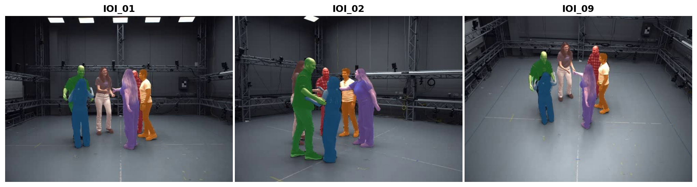

# [ma_masks]: Multi-view Multi-people Segmentation Masks for MAMMA

**Part of [MAMMA: Markerless Accurate Multi-person Motion Acquisition (CVPR 2026)](https://mamma.is.tue.mpg.de/)**.

This module is the segmentation step: it exports per-person binary masks that are used downstream by the MammaNet model.



## How It Works

The pipeline processes one camera at a time. The **init camera** (specified via `--cam_init`, or the first available
camera by default) is used to define the people that we want to track. On each **subsequent camera**, it detects people
and matches them to the init camera's IDs.

**Four detection modes are available:**

| Mode                              | Description                                                          | YOLO? |
|-----------------------------------|---------------------------------------------------------------------|:-----:|
| `--sam_version sam2`              | YOLO detects people → SAM2 tracks with multi-frame bbox anchors      |  Yes  |
| `--sam_version sam3`              | YOLO detects people → SAM3 tracks (single bbox anchor)               |  Yes  |
| `--sam_version sam3_prompt`       | SAM3 text prompt `"person"` detects **and** tracks, all in SAM3's full video predictor |  No   |
| `--sam_version sam3_prompt_light` | Same text prompt `"person"`, but detection runs on SAM3's detector and tracking on the lean SAM3 tracker — lighter than `sam3_prompt` (see Performance below) |  No   |

Alternatively, **instead of automatically** defining the people to be tracked, the `--interactive` opens a GUI on the
init camera where you can manually click on the people (keys 0-9 to switch person, left-click to mark, right-click to
remove). This replaces auto-detection on the init camera only - subsequent cameras are still matched automatically.
Works with all SAM versions. Requires a display.

In `sam3_prompt` mode, the pipeline first samples a small set of candidate frames, selects a prompt-frame using SAM3
mask-area-based scoring, then propagates from that frame.

**Cross-camera ID matching** uses two signals:

- **CLIP appearance**: encodes person crops with OpenCLIP (ViT-B-32) and matches them against a per-person appearance
  gallery / feature bank
- **Epipolar geometry**: uses pairwise calibration between the init camera and the current camera to score geometric
  consistency

The **Hungarian algorithm** makes the final one-to-one ID assignment across cameras - no duplicate IDs.

> **Note**: If SAM’s tracker deteriorates or fails to maintain identity consistency partway through a sequence in a
> single camera view, for example under severe occlusion, the pipeline does not explicitly detect or correct such
> failures. These may include identity swaps, track fragmentation, or complete loss of a subject in a given view.
> Identity matching at this stage is performed across cameras rather than temporally within each camera. In practice,
> the impact of occasional identity errors is often mitigated in the downstream **multi-view SMPL-X fitting** stage, where
> cross-view association is constrained by epipolar geometry and supported by the majority of views with correct masks.

## Performance & which mode to choose

Measured on one 6-person, 4-camera, 150-frame clip (per camera, 24 GB GPU), scored
against ground-truth masks. Numbers are indicative, not a formal benchmark.

| Mode                | Peak VRAM | Long sequences? | YOLO |
|---------------------|:---------:|:---------------:|:----:|
| `sam2`              | **~4.4 GB** | ✅ best (CPU-offload bounded) | Yes |
| `sam3`              | ~8 GB     | ✅ good (CPU-offload bounded) | Yes |
| `sam3_prompt`       | ~11.5 GB  | ⚠️ limited (~700 frames, then OOM) | No |
| `sam3_prompt_light` | ~8.8 GB   | ✅ good (handles full clips) | No |

On the clip tested, all modes recovered every ground-truth person with comparable
mask quality (mean IoU ~0.96–0.97); the small accuracy differences were within
run-to-run noise, so we don't rank modes by accuracy. The clear, repeatable
differences are **VRAM** and **how long a clip each can process**:

- **Lowest VRAM / longest sequences → `sam2`** (then `sam3`). Both keep decoded
  frames and tracker state on the host via CPU offload, so per-camera VRAM stays
  bounded and clip length is limited by host RAM rather than VRAM (`sam2` ran 1200+
  frames in testing).
- **Avoid `sam3_prompt` for long clips** — its session cache grows with frame count
  and OOMs around ~700 frames on a 24 GB GPU. Use `sam3_prompt_light` instead, which
  handles full-length clips at lower VRAM.
- **No YOLO needed → `sam3_prompt` / `sam3_prompt_light`** (they detect via SAM3
  text). One measured caveat: `sam3_prompt_light`'s cross-camera ID matching was
  slightly less consistent than the other modes on a 4-person clip.

Per-camera memory is driven mainly by sequence length. `sam2`, `sam3` and
`sam3_prompt_light` bound VRAM via CPU offload (`sam.offload_video_to_cpu`,
`offload_state_to_cpu`, `fp16_frames`); `sam3_prompt` (session API) is capped by an
internal cache prune (`sam.sam3_prune_cache_window`).

## Installation

Installation is managed by the parent `mamma_release` repo. See [`docs/INSTALL.md`](../docs/INSTALL.md) for the full env + CUDA + weights setup (including SAM 3's gated Hugging Face access and the optional Apptainer/Docker container recipes shipped in this folder); activate `mamma` before running `run_ma_masks.py`. Default weight locations (used both by the runner and by standalone invocations):

- YOLO: `data/weights/yolo/yolo12x.pt`
- SAM 2: `data/weights/sam2/sam2.1_hiera_large.pt`
- SAM 3: downloaded on first use to the local Hugging Face cache (e.g.
  `~/.cache/huggingface/.../models--facebook--sam3`), not under `data/weights/`. Pass
  `--sam_checkpoint <snapshot>/sam3.pt` to use a specific cached file (see below).

SAM 3 weights come from a **gated** Hugging Face model, so the SAM3 backends
(`sam3`, `sam3_prompt`, `sam3_prompt_light`) need an approved account and a local
`huggingface-cli login`. Inside a container that can't see the host's HF cache,
bypass cache discovery by passing the checkpoint explicitly:

```bash
python segmentation/run_ma_masks.py \
  --ma_cap_dir /path/to/dataset --seq_name my_sequence \
  --out output/ --sam_version sam3_prompt --cfg segmentation/configs/sam3.yaml \
  --sam_checkpoint .hf_cache/hf_cache/hub/models--facebook--sam3/snapshots/<SNAPSHOT_ID>/sam3.pt
```

## Quick Start

> **Run from the repository root.** The bare `--cfg` default (`configs/...`) only
> resolves when launched from inside `segmentation/`, so pass the config
> explicitly: add `--cfg segmentation/configs/sam2.yaml` for SAM2 runs, or
> `--cfg segmentation/configs/sam3.yaml` for `sam3` / `sam3_prompt` /
> `sam3_prompt_light`.

### Basic (NPZ input, SAM2)

```bash
python segmentation/run_ma_masks.py \
  --ma_cap_dir /path/to/dataset --seq_name my_sequence \
  --out output/ --cam_init IOI_09
```

### SAM3 text prompt (no YOLO needed)

```bash
python segmentation/run_ma_masks.py \
  --ma_cap_dir /path/to/dataset --seq_name my_sequence \
  --out output/ --sam_version sam3_prompt --cam_init IOI_09
```

### From image directories

```bash
# Expected: images_root_dir/<cam_name>/<frame>.jpg
python segmentation/run_ma_masks.py \
  --ma_cap_dir /path/to/dataset --seq_name my_sequence \
  --out output/ --images_root_dir /path/to/frames/ --cam_init cam_01
```

### From MP4 videos

```bash
python segmentation/run_ma_masks.py \
  --ma_cap_dir /path/to/dataset --seq_name my_sequence \
  --out output/ --videos_dir /path/to/videos/ --cam_init camera_01
```

When both `--videos_dir` and `--ma_cap_dir` are provided, frames are read from videos (faster) and camera calibration (
K, R, T) is loaded from NPZ files (for epipolar geometry).

### Frame range

```bash
python segmentation/run_ma_masks.py \
  --ma_cap_dir /path/to/data --seq_name my_sequence \
  --out output/ --start 10 --end 60
```

### Subset of cameras

```bash
python segmentation/run_ma_masks.py \
  --ma_cap_dir /path/to/dataset --seq_name my_sequence \
  --out output/ --cam_names IOI_01 IOI_02 IOI_09
```

By default, all cameras in the sequence are processed. Use `--cam_names` to
restrict processing to a specific list (names must match the NPZ / MP4 / image
directory names).

### Interactive (click on people via GUI)

```bash
python segmentation/run_ma_masks.py \
  --ma_cap_dir /path/to/dataset --seq_name my_sequence \
  --out output/ --cam_init IOI_09 --interactive
```

Keys **0-9** switch person ID, **left-click** marks a person, close window when done. Only the init camera uses the GUI;
other cameras are matched automatically. Requires a display.

### Skip overlay visualization

```bash
python segmentation/run_ma_masks.py \
  --ma_cap_dir /path/to/dataset --seq_name my_sequence \
  --out output/ --sam_version sam3_prompt --skip_masked_outputs
```

Saves time and disk by skipping overlay images and MP4. Mask PNGs and `masks.npy` are still produced.

## Configuration

Config files in `configs/` control all parameters. Each argument is documented inline.

| File (pass via `--cfg`, from repo root)  | --sam_version                                  |
|------------------------------------------|------------------------------------------------|
| `segmentation/configs/sam2.yaml`         | For `sam2`                                     |
| `segmentation/configs/sam3.yaml`         | For `sam3` + `sam3_prompt` + `sam3_prompt_light` |

Key options:

```yaml
scene:
  expected_subjects: null        # null = auto-detect, or set fixed N

matching:
  start_frame: 10                # skip early frames (setup/blur)
  sample_interval: 50            # sample every Nth frame for detection
  yolo_person_conf: 0.5          # YOLO confidence (lower = catch more people)
  min_mask_area_ratio: 0.01      # suppress tiny masks / outsider tracks
  sam3_redetect_samples: 30      # max candidate prompt frames (sam3_prompt)
  clip_weight: 0.4               # appearance matching weight
  epipolar_weight: 0.6           # geometric matching weight

masks:
  merge_duplicate_tracklets: true  # merge near-identical tracklets (same person tracked twice)
  merge_iou_threshold: 0.95        # mask IoU threshold for merging (very conservative)
  discard_tiny_tracklets: true     # remove tracklets that are too small on most frames
  tiny_tracklet_min_area_ratio: 0.005  # min mask area as fraction of image
  tiny_tracklet_min_frame_ratio: 0.2   # discard if small on >80% of frames

sam:
  propagate_reverse: true        # propagate backward from init frame

# sam3_prompt only: override SAM3 internal tracking parameters
sam3_tracking:
  new_det_thresh: 0.85           # higher = fewer spurious new tracklets
  trk_assoc_iou_thresh: 0.25     # lower = stickier existing tracks
  init_trk_keep_alive: 60        # frames a track survives without re-matching
  max_trk_keep_alive: 60
```

### Overriding from the CLI

A few common settings can be passed directly on the command line without
editing the YAML:

- `--cfg segmentation/configs/sam3_default.yaml` — use a different config file
  (e.g. SAM3 with its unmodified tracking defaults instead of the tuned values
  in `segmentation/configs/sam3.yaml`).
- `--expected_subjects N` — tell the pipeline to expect exactly N people in
  the scene. Otherwise N is auto-inferred from init-camera detections.

## Output

```
output/<seq_name>/
    run.log                      # full log file for this run
    subject_feature_bank.npy     # cached CLIP feature bank
    cross_camera_summary/        # per-person cross-camera consistency images
    <camera>/
        masks/                   # per-frame per-person binary mask PNGs
        masks.npy                # mask data + metadata cache
        masked_outputs/          # colored overlay video (MP4)
        initialize/              # init-camera subject initialization visuals (all modes)
        pre_remap/               # raw SAM3 IDs before remapping (sam3_prompt)
        person_XX_crop_summary.png  # per-person crop samples across frames
        anchor_report.json       # anchor frame details (sam2/sam3)
        anchor_visualizations/   # prompt visualizations (sam2/sam3)
```

## Project Structure

```
run_ma_masks.py              # CLI entry point (recommended)
process_sequence.py          # lower-level sequence entry point (run_ma_masks.py wraps this)
core/
    pipeline.py              # main segmentation engine
    predictor_factory.py     # SAM2/SAM3 predictor builders + adapters
    frame_source.py          # unified frame access (images / MP4)
    video_reader.py          # in-memory MP4 reader
    logging.py               # loguru config (INFO→stdout, WARN+→stderr)
configs/
    sam2.yaml                # SAM2 config (documented)
    sam3.yaml                # SAM3 config — tuned tracking defaults
    sam3_default.yaml        # SAM3 config — unmodified upstream tracking defaults
utils/                       # drawing, paths, GUI, math, visualization helpers
scripts/                     # standalone helper tools (e.g. check_ready.py)
tests/                       # unit tests
```

## Tests

```bash
pytest tests/ -v
```

Citation, license, and acknowledgments live in the [top-level README](../README.md).
